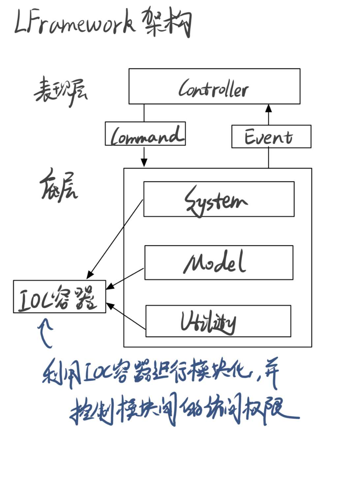
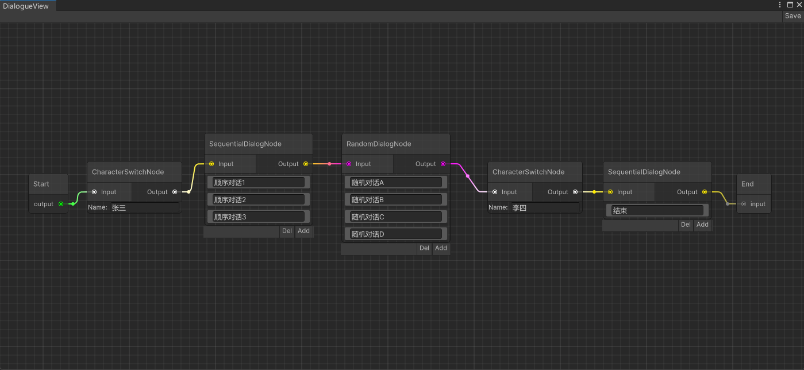
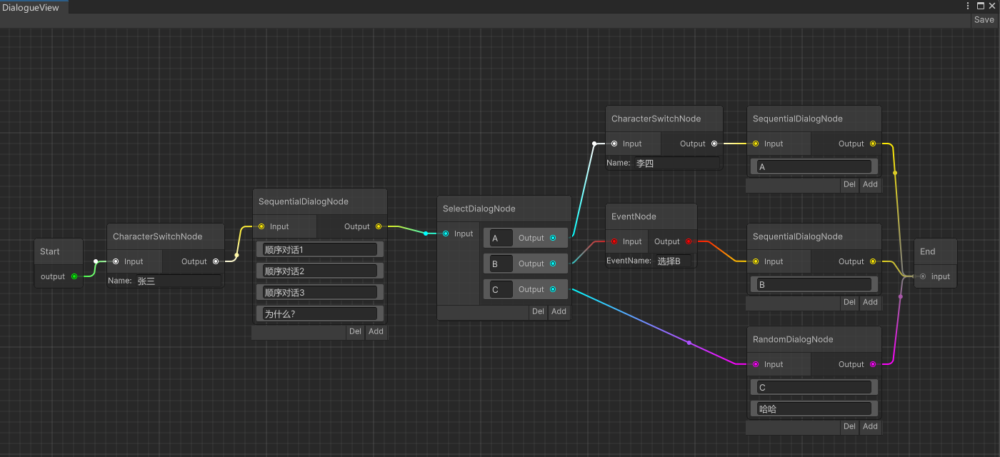
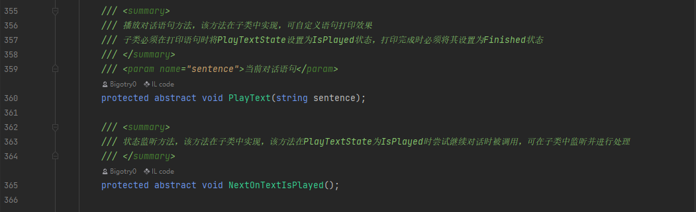

# LFramework
Unity项目开发架构，以及各种工具集，例如基于节点的对话系统。

## 框架结构
如下图：

## 框架使用
导入下载的unitypackage即可

## 框架文档
//todo

## 对话系统使用
### 创建对话树文件
1、确保LFramework导入项目

2、在Project窗口右键创建一个对话树文件  

3、双击文件即可进入对话编辑器

### 编辑对话树
1、在节点图里右键打开菜单

2、选择所要创建的节点

3、连接节点图

对话树示例：

### 对话树文件使用
1、创建自己的对话系统组件，只需继承包里的DialogueSystem即可

2、实现抽象方法PlayText和NextOnTextIsPlayed

3、在GO挂上该组件，引用创建好的对话树文件，并在Inspector配置事件即可